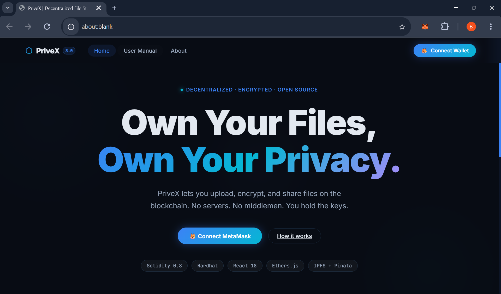
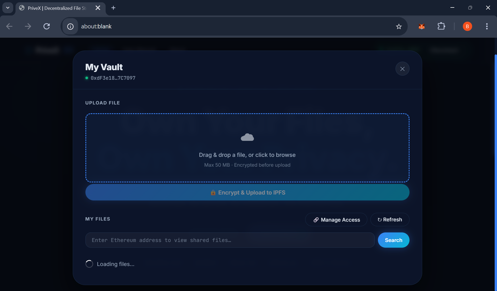
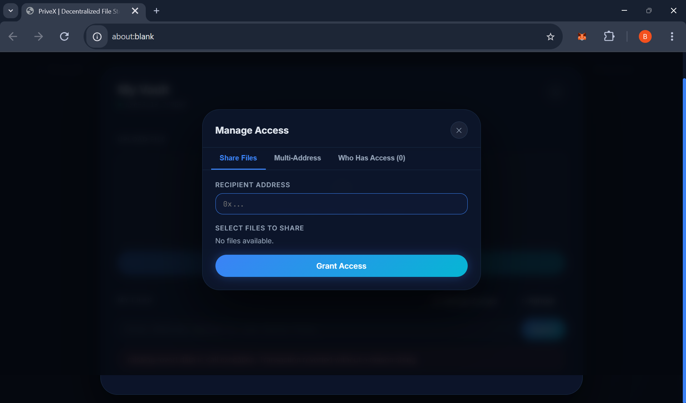

# ⬡ PriveX 3.0 — Decentralized File Storage & Access Control

<p align="center">
  
  
  
  
  
  
</p>

> **Store files on IPFS. Encrypt them in your browser. Control access on-chain.**
> No servers. No middlemen. You own your data.

---

## 🌐 Live Demo

The original v1 of this project is deployed at:
**[https://privex30.vercel.app](https://privex30.vercel.app)** ← **(v1 — original project)**

The original GitHub repository:
**[rangabharathkumar/PriveX_3.0-A-Blockchain-based-secure-data-sharing-platform](https://github.com/rangabharathkumar/PriveX_3.0-A-Blockchain-based-secure-data-sharing-platform)**

> ⚠️ The live demo runs the **old version (v1)** of the frontend (before this professionalization refactor).
> To see the **new v3.0 UI**, follow the [Quick Start](#quick-start) guide below to run it locally.

---

## 📸 Screenshots (PriveX v3.0 — New UI)

| Landing Page | File Vault | Access Manager |
|:---:|:---:|:---:|
|  |  |  |

---

## 📖 Table of Contents

- [What Changed from v1](#what-changed-from-v1)
- [Features](#features)
- [Architecture](#architecture)
- [Tech Stack](#tech-stack)
- [Quick Start](#quick-start)
- [Environment Variables](#environment-variables)
- [Running Tests](#running-tests)
- [Deployment](#deployment)
- [Contributing](#contributing)
- [License](#license)

---

## 🆕 What Changed from v1

This repository (`privex/`) is a complete professional refactor of the original project. Here's what's new:

| Area | v1 (Original) | v3.0 (This repo) |
|---|---|---|
| **Contract Address** | Hardcoded in `App.js` | Read from `.env` |
| **Pinata Keys** | Hardcoded in `FileUpload.js` | Read from `.env` |
| **Tests** | None | 17 unit tests (all passing) |
| **Web3 State** | Scattered across components | Centralized `Web3Context.js` |
| **Design** | Basic dark theme | Glassmorphism + CSS design system |
| **Deploy Script** | Manual address copy | Auto-updates `client/.env` |
| **Documentation** | Single README | README + Architecture + ENV guide |
| **GitHub Files** | None | Issues templates, CONTRIBUTING.md |
| **MetaMask Errors** | Crash | Graceful error banners |
| **Group Sharing** | Basic | Full group create/add/share UI |

---

## Features

| Feature | Description |
|---|---|
| 🔐 Client-side AES-256 encryption | Files are encrypted before upload — never in plaintext on IPFS |
| ⛓️ Smart contract access control | `allow()` and `disallow()` functions control who sees what |
| 🌐 IPFS storage | Decentralized, censorship-resistant file storage via Pinata |
| 🔗 Granular file sharing | Share specific files (by ID) with specific addresses |
| 👥 Multi-address / group sharing | Share with multiple people or named groups in one transaction |
| 🔑 Access revocation | Remove access at any time — honored immediately on-chain |
| 📱 Responsive UI | Works on desktop and mobile |
| 🧪 Contract test suite | 17 Hardhat/Chai tests covering all contract functions |

---

## Architecture

> 📐 **Full architecture diagrams** → [docs/ARCHITECTURE.md](./docs/ARCHITECTURE.md)

```
┌──────────────────────────────────────────────────────────────┐
│                      USER'S BROWSER                          │
│                                                              │
│   React App ──► AES-256 Encrypt ──► Pinata (IPFS Pin)       │
│       │                                    │                 │
│       │◄── MetaMask (sign tx)        IPFS Hash              │
│       │                                    │                 │
│       └──────────────────────────── Ethereum Smart Contract  │
│                                      (Upload.sol)            │
└──────────────────────────────────────────────────────────────┘
```

**Data flow:**
1. User picks a file → browser encrypts with AES-256
2. Encrypted blob pinned to IPFS → Pinata returns IPFS hash
3. `contract.add(address, fileName, ipfsUrl)` records it on-chain
4. To share: `contract.allow(recipient, [fileIds])` → on-chain grant
5. Recipient's `contract.display(ownerAddr)` returns only allowed files
6. Browser fetches encrypted blob, decrypts locally, opens in tab

---

## Tech Stack

| Layer | Technology |
|---|---|
| Smart Contract | Solidity 0.8.19 |
| Dev Environment | Hardhat 2.22 |
| Contract Testing | Hardhat + Chai + Ethers.js |
| Frontend | React 18, React Router v6 |
| Web3 | Ethers.js v5 |
| Encryption | CryptoJS (AES-256) |
| File Storage | IPFS via Pinata |
| File Upload UI | react-dropzone |
| Wallet | MetaMask |

---

## Quick Start

### Prerequisites
- Node.js ≥ 18
- MetaMask browser extension
- A free [Pinata](https://pinata.cloud) account

### 1. Clone & install

```bash
git clone https://github.com/rangabharathkumar/PriveX_3.0-A-Blockchain-based-secure-data-sharing-platform.git
cd privex

# Hardhat dependencies
npm install

# React client dependencies
cd client && npm install && cd ..
```

### 2. Set up environment variables

> 💡 **Step-by-step guide with screenshots** → [docs/ENV_SETUP.md](./docs/ENV_SETUP.md)

```bash
# Copy the template
cp .env.example .env
cp client/.env.example client/.env

# Then fill in your Pinata API keys in client/.env
```

### 3. Start local blockchain (Terminal 1)

```bash
npm run node
# Starts at http://127.0.0.1:8545
# Prints 20 test accounts with private keys — import one to MetaMask
```

### 4. Deploy contract (Terminal 2)

```bash
npm run deploy:local
# Automatically updates client/.env with the new contract address ✅
```

### 5. Start the React app (Terminal 3)

```bash
npm run client
# Opens at http://localhost:3000
```

### 6. Connect MetaMask

- Set network to: **Localhost 8545** (Chain ID `31337`)
- Import a Hardhat test account using its private key from Terminal 1
- Click **Connect Wallet** on the app

---

## Environment Variables

> 💡 Confused? Follow the [Detailed ENV Setup Guide](./docs/ENV_SETUP.md).

### `client/.env` — React App

| Variable | Description |
|---|---|
| `REACT_APP_CONTRACT_ADDRESS` | Auto-filled by `npm run deploy:local` |
| `REACT_APP_PINATA_API_KEY` | From your Pinata dashboard |
| `REACT_APP_PINATA_SECRET_KEY` | From your Pinata dashboard |
| `REACT_APP_ENC_KEY` | Any strong random string you choose |

### `.env` — Hardhat (only needed for Sepolia testnet)

| Variable | Description |
|---|---|
| `INFURA_URL` | Alchemy/Infura RPC URL for Sepolia |
| `PRIVATE_KEY` | MetaMask private key (use a burner wallet!) |

---

## Running Tests

```bash
npm test
```

```
  Upload Contract
    File Management
      ✔ Should add a file and return it
      ✔ Should assign incrementing IDs to files
      ✔ Should revert if fileName is empty
      ✔ Should revert if url is empty
      ✔ Should emit FileAdded event
    Access Control
      ✔ Owner can view their own files via display()
      ✔ Non-owner cannot view files without access
      ✔ Owner can grant access to a user for specific files
      ✔ Owner can revoke access
      ✔ shareAccess() returns the access list
      ✔ Should emit AccessGranted event
      ✔ Should emit AccessRevoked event
    Group Sharing
      ✔ Should create a group
      ✔ Should add members to a group
      ✔ Should share files with all group members
      ✔ Should revert if group name is empty
      ✔ Should not add duplicate members to a group

  17 passing ✅
```

---

## Deployment

### Deploy to Sepolia Testnet

1. Get free Sepolia ETH from [sepoliafaucet.com](https://sepoliafaucet.com)
2. Get an RPC URL from [Alchemy](https://alchemy.com) or [Infura](https://infura.io)
3. Fill in the root `.env`:
   ```
   INFURA_URL=https://eth-sepolia.g.alchemy.com/v2/YOUR_KEY
   PRIVATE_KEY=your_64_char_private_key
   ```
4. Deploy:
   ```bash
   npm run deploy:sepolia
   ```
5. Update `client/.env` with the new contract address
6. Deploy the frontend to Vercel:
   ```bash
   cd client && npm run build
   # Upload build/ to Vercel dashboard or use Vercel CLI
   ```

---

## Contributing

Contributions are welcome! Read [CONTRIBUTING.md](./CONTRIBUTING.md) for guidelines.

1. Fork the repo
2. Create a branch: `git checkout -b feature/your-feature`
3. Ensure tests pass: `npm test`
4. Open a Pull Request

---

## License

This project is licensed under the [MIT License](../../../../LICENSE) of this repository.
