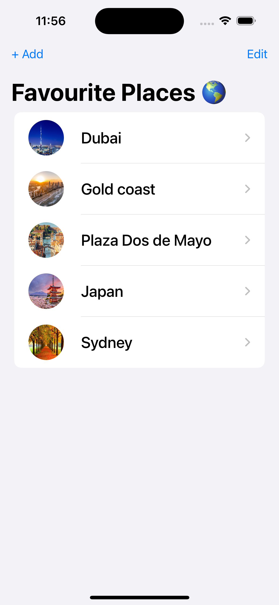
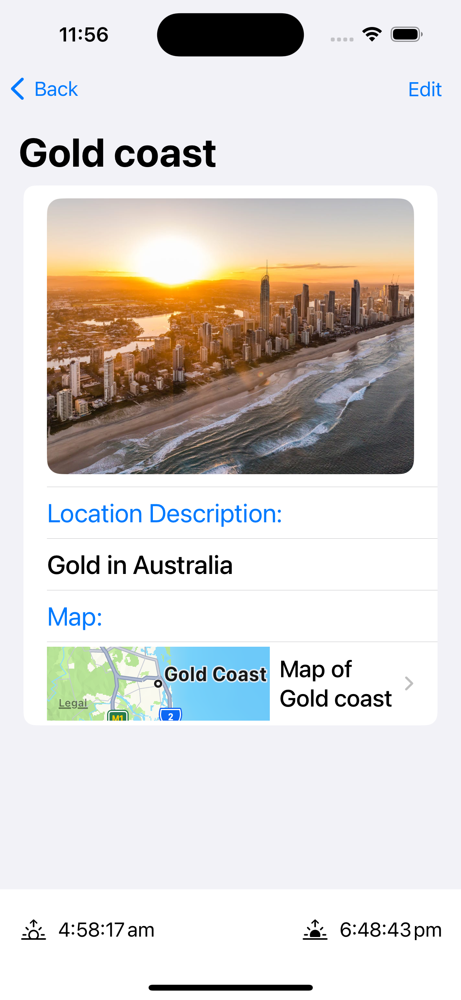
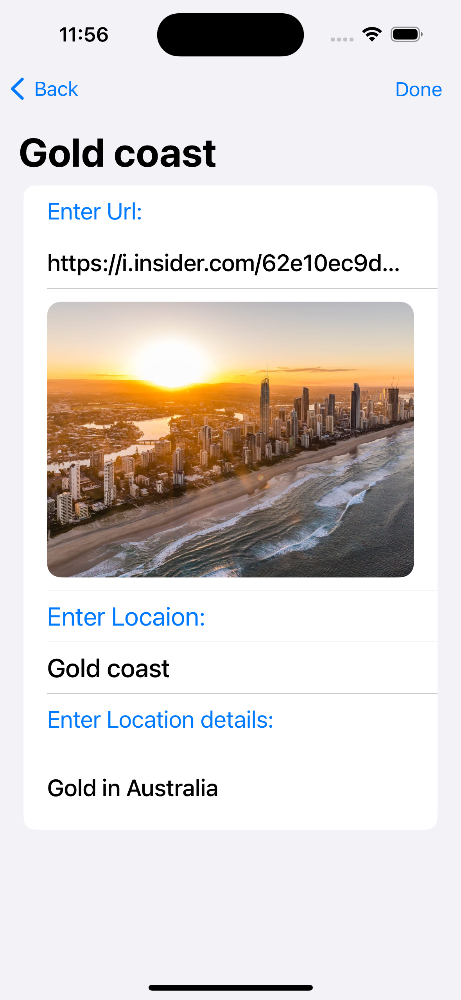
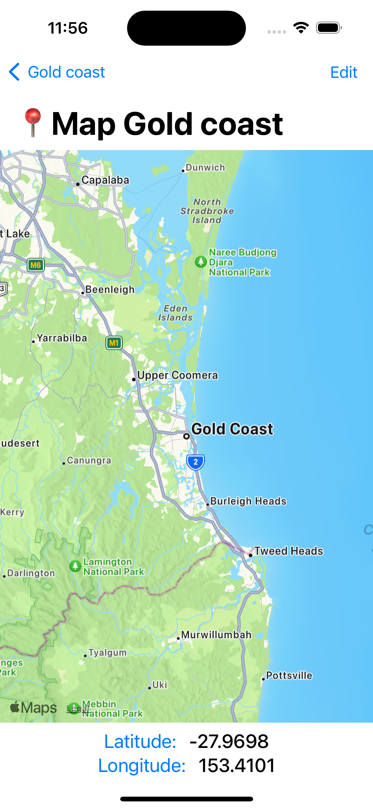

# IOS-APP
- Ios app written in Swift on Xcode. 
- You can Create or Find any location (place) and create a list of saved Places.
- The App uses AppleMaps for Map service, and also Location Service (when enabled).

# ``FavouritePlaces 🌏``

ios Application that has list of places with image, detailed view display details map of the location, in mapview user can ajust location or cordinates. 

## Overview

This aim is to use CoreData to develop a dynamic Master/Detail app with persistent data.  The app's purpose is to maintain a list of my favourite locations, complete with descriptions and images. Persistent data is used to implement a Master/Detail view. Various locations are listed in the Master View.  The name of the place and a thumbnail preview of the photograph are displayed next to each entry in the list (item). You can add, remove, and edit components in the detail View in its entirety. The navigation view contains the list. Each item has a Navigation Link embedded in it that can be clicked (or touched) to get a Detail View. The image (or its URL if editing mode is active), name, location, and description are all displayed in the Detail View.  The description and picture URLs are just two of the totally changeable sections.  The upper left corner of the Detail View also features a back button that returns the user to the Master View and often displays the name of the list.

## From the app you can learn:
- how to add map in app
- how to use map region to update location
- how to fetch cordinates from map
- extension of any class
- how to use map for location and cordinates
- how to fetch time zone 
- how to set sunset and sunrise

# screenshots 

    
    
    
    

